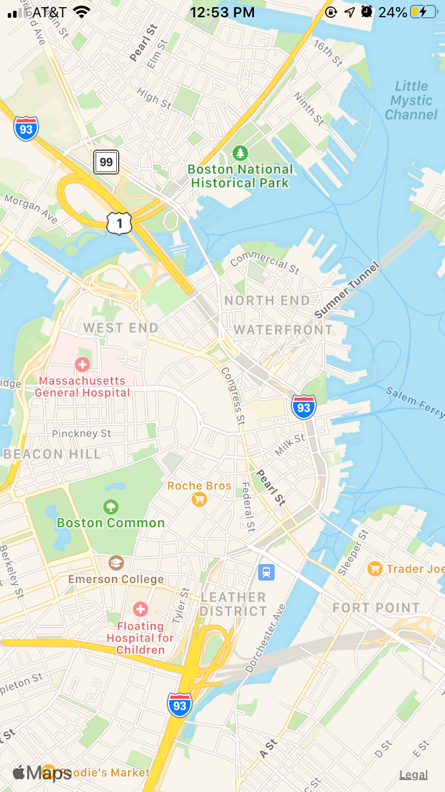
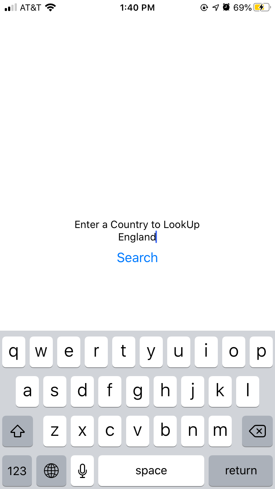

# codvid-app-snevarez1129

## Assignment
Use CODVID-19 API (Documentation using postman) to build mobile application that displays:
* CODVID cases per country on a MAP
* CODVID cases per country Live on a MAP (changes)
* CODVID cases per country based on a date.
* Summary of total cases for the world
* Live Summary for the World

###### Stretch goal:
* Display data per Province
* User can put their address and track CODVID-19 in their neighborhood (Only in countries where regional data is provided)

## Progress

